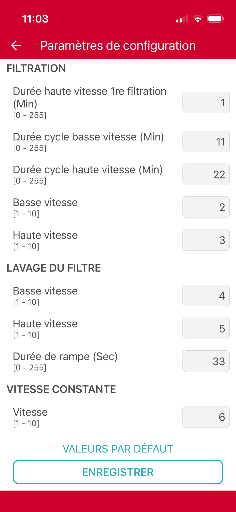
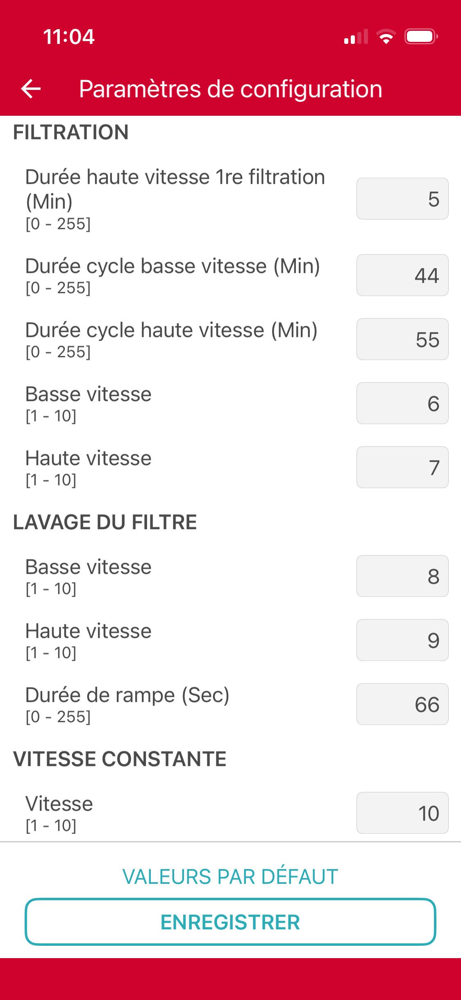

# Espa Silen → Home Assistant (proof of concept)

Control an **Espa "Silen" variable-speed pool pump** from **Home Assistant** instead of
being stuck with the official **evopool** Bluetooth app.

> ⚠️ **Proof of concept / template — read the disclaimers below.** This repo shows a
> *method* and gives you the *generic plumbing + Home Assistant examples*. It does **not**
> contain Espa's protocol: the two device-specific functions are left as stubs for you to
> fill in for your own pump.

## Why?

Espa's variable-speed pumps (Silen Plus 2M and friends) are configured through the
**evopool** phone app over Bluetooth LE. The app is fine to *set* the pump up once, but it
is **very poor for automation**:

- no real scheduling logic (let alone sun-based: "low at night, normal by day"),
- no way to **coordinate** the pump with the rest of the pool — e.g. only run the salt
  **chlorinator** or the **booster/cleaner** when the pump is actually running fast enough,
- no integration with any home-automation system.

So the pump just sits there, smart hardware behind a dumb app.

> 💡 **If only Espa made evopool natively Home Assistant–compatible** — a small *local* API
> (or Matter / MQTT), and *time-based speed scheduling* in the app — none of this would be
> necessary. Espa, if you ever read this: please do that. It's a great pump; let people
> automate it. 🙂

Until then, here's a do-it-yourself bridge.

## What this is (and isn't)

- ✅ A **method** to read/drive such a pump locally and wire it into Home Assistant.
- ✅ **Generic, reusable code**: a tiny authenticated HTTP service, the Bluetooth
  connect/disconnect handling, and **ready-to-adapt Home Assistant automations**.
- ❌ **Not** a turnkey product, not a spec of Espa's protocol, not affiliated with Espa.
- ❌ The pump's Bluetooth frames are **proprietary to Espa and are not published here.**
  Decode your **own** device (see *Method*) and fill in the two stubs.

## Method (decode your own pump)

You really only need **two operations** to make the pump useful:

1. **read** its current state — the running *mode* and the *speed*;
2. **set** one thing — the **filtration speed** — which you then *schedule* from Home Assistant.

How to get there (an afternoon's work, easy to reproduce with an AI assistant):

1. **Capture** the Bluetooth-LE traffic between the evopool app and the pump while you press
   buttons in the app — e.g. Android *HCI snoop log*, or iOS via macOS **PacketLogger**, or a
   dedicated BLE sniffer. Open the capture in Wireshark.
2. **Find** the single characteristic the app writes to and reads notifications from, and,
   by changing one value at a time in the app, **work out** the few bytes that encode "speed"
   and the bytes that report "mode / speed". An LLM is genuinely good at this: feed it the
   annotated captures ("I set speed X, then Y") and ask it to find the pattern.
3. **Fill in** `ble_read()` and `ble_set()` in [`evopool_agent.py`](evopool_agent.py) using the
   provided `bt_session()` helper (generic `bluetoothctl` connect → write → notify → disconnect).
4. **Automate** from Home Assistant (below).

### Tip — make each setting trivial to spot

The evopool *"configuration"* screen exposes a handful of static settings (speeds on a
1-10 scale, plus a few durations). The fastest way to map them to bytes: set **every field
to a distinct, memorable value**, screenshot it, capture the Bluetooth write — then set them
all to **another** distinct set and capture again. Because every field has a unique value,
you (or your AI) can immediately tell which byte carries which setting by diffing the two
captures against the two screenshots.

| Capture A — values `1 / 11 / 22 / 2 / 3 / 4 / 5 / 33 / 6` | Capture B — values `5 / 44 / 55 / 6 / 7 / 8 / 9 / 66 / 10` |
|:--:|:--:|
|  |  |

Hand these two screenshots **and** your two captures to an AI assistant and ask it to line up
"setting → value → byte". That's the whole decoding step. *(The screenshots show only the
app's own UI — nothing proprietary. Labels are French here; your app's language may differ.)*

### Tip — read the live status (current speed & power)

The screenshots above decode the *static config*. The pump also pushes a **live status**
notification carrying its running *mode*, *current speed* and *power draw*. This one you decode
**dynamically** — start from the settings, then **make the values change and observe**:

- **Current speed.** Run the pump and step the speed `1 → 10` (from the app, or via your
  freshly-implemented `ble_set`). Capture the status notification at each step. The byte that
  **changes once per speed then stays put** is the current speed. Record every `(speed → byte)`
  pair — the reported value may use a *different scale* than the 1-10 setting, so you want the
  real mapping (it usually matches the encoding you already found in the settings frame —
  cross-check the two).

- **Power.** You can't *set* power — it's a measurement, so use a different tell: hold a
  **constant** speed and capture several status frames in a row. The byte(s) that **jitter while
  everything else stays stable** are the live reading (power). Confirm by raising the speed:
  power should climb, and climb **faster than linearly** (a variable-speed pump's draw rises
  steeply with speed). It is often a **16-bit** value — a pair of bytes; try both byte orders.

What to give your AI: (1) a list of `running speed → full status frame (hex)` across the whole
range, and (2) several frames captured at **one fixed speed**. Ask it for *"the byte that is
constant per speed"* (current speed) and *"the byte(s) that grow with speed and fluctuate at
constant speed"* (power). Align all frames on the status frame's fixed header/marker before you
compare offsets.

> The point of the repo is the *architecture* + the *Home Assistant side*. The decoding is
> yours to do for your device — which also keeps Espa's proprietary details out of here.

## Architecture

```
  Espa Silen pump  ──BLE──  small Linux box (BLE adapter, near the pool, e.g. a Raspberry Pi)
                                   │  evopool_agent.py  (HTTP, Basic auth)
                                   │     GET  /state   -> {mode, niveau, puissance}
                                   │     POST /set     -> {param, valeur}
                                   │     POST /pause    (frees the BLE link for the app)
                                   ▼
                            Home Assistant   (all the logic: schedules, interlocks, safety)
```

The pump accepts **one BLE connection at a time**, so the agent **connects, talks, then
disconnects** on every call (and offers `POST /pause` to step aside when you want to use the
evopool app). Reads are **on-demand**: Home Assistant polls `/state` on its own schedule.

## The HTTP service

| Method | Path | Body | Returns |
|---|---|---|---|
| GET | `/state` | – | `{"mode","niveau","puissance","paused"}` |
| POST | `/set` | `{"param":"filtr_basse","valeur":4}` | `202` (applied asynchronously) |
| POST | `/pause` | `{"minutes":5}` | frees the BLE link for the evopool app |
| POST | `/resume` | – | – |

All endpoints require HTTP **Basic auth** (set in `config.ini`). See
[`config.example.ini`](config.example.ini).

## Home Assistant integration

This is the part you can reuse directly — nothing proprietary here. Full examples in
[`homeassistant/`](homeassistant/). In short:

- a **`rest`** sensor set reads `/state` → `sensor.pump_mode`, `sensor.pump_speed`, `sensor.pump_power`;
- a **`rest_command`** posts to `/set`;
- an **`input_number`** holds the desired filtration speed;
- **automations** then do what evopool can't, e.g.:
  - **schedule** the filtration speed (low at night / normal by day / higher during the cleaner cycle),
  - **interlocks**: run the chlorinator only when the pump runs at/above some speed; run the
    booster only above a higher speed,
  - **safety**: if the pump stops or stops answering → cut chlorinator + booster.

See [`homeassistant/automations.example.yaml`](homeassistant/automations.example.yaml) for
commented examples (event-driven on the sensors, with periodic re-assert as a backstop).

## Running it

On a Linux box with BlueZ and a BLE adapter (a Raspberry Pi works well):

```sh
sudo apt install bluez python3      # or your distro's equivalent
cp config.example.ini config.ini    # set [ble] mac/char and [web] user/pass
bluetoothctl trust AA:BB:CC:DD:EE:FF # so the agent connects without scanning every time
python3 evopool_agent.py            # serves on :8095
```

Run it as a service (systemd, or the OpenWrt `procd` example in
[`openwrt/`](openwrt/)). Open the chosen port to your Home Assistant host.

## Disclaimer

This is an **unofficial, hobbyist proof of concept**, provided **as-is, with no warranty**.
It is **not affiliated with, endorsed by, or supported by Espa**, and contains **no Espa
proprietary material** — the device protocol is yours to reverse-engineer for your own
equipment. You are responsible for anything you do to your own pump and pool. See
[`LICENSE`](LICENSE) (GPL-3.0).
